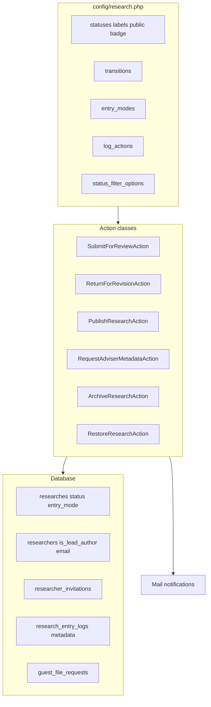

# Research Status & Workflow — Full Implementation Plan

## Locked product decisions (from your final answers)

### No `is_legacy_import` column

Use `**entry_mode**` on `researches` instead (set at create time by staff/faculty):


| `entry_mode`               | Who creates | Initial status | Workflow                                               |
| -------------------------- | ----------- | -------------- | ------------------------------------------------------ |
| `faculty_student`          | Faculty     | `draft`        | Student completes → submits → faculty return/publish   |
| `staff_direct_publish`     | Staff       | `published`    | Current or backfill; no student workflow               |
| `staff_faculty_completion` | Staff       | `draft`        | Staff-faculty only; email adviser to complete metadata |


Staff chooses mode on create — covers both historical and current staff-uploaded research without a legacy flag.

### No withdraw (v1)

Do **not** implement `submitted → draft`. Faculty may **edit while `submitted_for_review`** and **publish directly** when fixed. Students cannot edit while submitted.

### Staff → faculty metadata request (not “returned to student”)

When staff needs adviser input on a **staff-created** entry:

- Action: `**request_adviser_metadata**` (log action, not a new status)
- Status becomes `**returned_for_revision**` BUT UI label = **“Awaiting adviser input (requested by MCIIS Staff)”**
- Email **faculty adviser only** with staff note
- **No email to students** (entry_mode ≠ faculty_student or no student linked)

### Wrong researcher email

- Researcher rows **require email** when entry_mode = `faculty_student` and invitations are sent
- Store `**researcher_invitations**` (token, researcher_id, email_snapshot, expires_at, revoked_at)
- On email change: **revoke** pending invitations for that researcher
- Old link → Inertia page: **“This invitation is no longer valid. Your email may have been corrected. Contact your research adviser.”**
- If wrong person already registered: out of scope for auto-fix; adviser/staff corrects manually

### Hard delete (final)


| Rule                  | Detail                                                                                     |
| --------------------- | ------------------------------------------------------------------------------------------ |
| Default removal       | **Archive** (all roles who can archive)                                                    |
| Hard delete           | **MCIIS Staff only**, status `**draft` only**, confirmation modal, reason required, logged |
| UI                    | Hide delete on non-draft; archive is primary action                                        |
| Wrong published entry | **Archive**, not delete; restore blocked if title conflict                                 |


### Shared status filter dropdown (filterable features only)

Options (identical everywhere): **Published (default)**, Draft, Submitted for Review, Returned for Revision, Archived, All.

**Hard restricted (no filter):** Browse, Top 5 accessed — **published only always**.

**Filterable:** Matrix, Compilation, program/year admin counts, faculty dashboard advised/paneled.

**Top keywords:** all searches (no status filter).

### Terminology

- `**status = published**` = visible in repository
- `**published_month` / `published_year**` = **Completion date** in UI (UDR “Date Completed”)
- UI button: **Publish** (not Approve)

### Roles summary


| Action                      | Faculty (own advised) | Staff                                  | Admin          | Student                 |
| --------------------------- | --------------------- | -------------------------------------- | -------------- | ----------------------- |
| Create (faculty_student)    | Yes                   | —                                      | No             | No                      |
| Create (staff modes)        | —                     | Yes                                    | No             | No                      |
| Edit draft/returned         | Yes                   | Yes                                    | No             | Yes (linked researcher) |
| Edit submitted              | Yes (not student)     | staff modes only                       | No             | No                      |
| Submit for review           | Edge: no student      | No                                     | No             | Yes (linked)            |
| Return w/ note              | Yes                   | staff_faculty only                     | No             | No                      |
| Publish                     | Yes                   | staff_direct + after faculty completes | No             | No                      |
| Archive non-published       | Yes                   | Yes                                    | No             | No                      |
| Archive published           | No                    | Yes                                    | No             | No                      |
| Restore                     | No                    | Yes                                    | No             | No                      |
| Hard delete                 | No                    | Draft only                             | No             | No                      |
| Matrix / Compilation export | No                    | No                                     | Yes (filtered) | No                      |
| `/logs/*`                   | No                    | No                                     | Yes            | No                      |
| Status History on research  | Own                   | All                                    | Read-only      | Own research            |


---

## Architecture overview




---

## STEP 1 — Database & configuration foundation

### 1.1 Create `[config/research.php](config/research.php)`

- `defaults.create` = `draft`, `defaults.seed` = `published`, `defaults.restore` = `published`
- `statuses` (5 values + labels + `public` + badge color)
- `transitions` (your B1 table + staff Draft→Published + staff status change after restore)
- `entry_modes` (3 modes + labels + who can set)
- `log_actions` (submit, return, publish, archive, restore, request_adviser_metadata, hard_delete)
- `status_filter_options` (shared dropdown values)
- `edit_rules` by status + role (used by policy helper)
- `publish_requirements` and `draft_requirements` arrays

### 1.2 Edit `[database/migrations/2025_09_04_063416_create_research_table.php](database/migrations/2025_09_04_063416_create_research_table.php)`

Add (no SQL default on status):

```php
$table->string('status', 50)->index();
$table->string('entry_mode', 50)->default('faculty_student')->index();
$table->timestamp('submitted_at')->nullable();
$table->timestamp('published_at')->nullable();
// keep archived_at, archived_by, archive_reason
```

### 1.3 Edit `[database/migrations/2025_09_04_154144_create_researchers_table.php](database/migrations/2025_09_04_154144_create_researchers_table.php)`

- Add `is_lead_author` boolean default false
- Change email: **nullable globally** but validated required for `faculty_student` invitations in Form Request
- Add index on `(research_id, is_lead_author)`

### 1.4 New migration files (allowed for invitations/guest — not status)

- `create_researcher_invitations_table` — token hash, researcher_id, email_snapshot, expires_at, revoked_at, accepted_at
- `create_guest_file_requests_table` — guest session/user ref, research_id, file_type, status, lead_approved_at, adviser_approved_at

### 1.5 PHP enums & helpers

- `[app/Enums/ResearchStatus.php](app/Enums/ResearchStatus.php)`
- `[app/Enums/ResearchEntryMode.php](app/Enums/ResearchEntryMode.php)`
- `[app/Support/ResearchStatusConfig.php](app/Support/ResearchStatusConfig.php)` — transitions, labels, filter options, context-aware status label (staff metadata request)

### 1.6 Update `[app/Models/Research.php](app/Models/Research.php)`

- Cast `status`, `entry_mode`
- `creating` → set status from config + default entry_mode
- `archive()` / `restore()` sync status + archive columns (clear `archived_at` on restore)
- `canTransitionTo()`, `displayStatusLabel()`, `latestRevisionNote()`, `statusHistory()`
- Relationship `researchEntryLogsTargeting()`

### 1.7 Update `[app/Traits/ResearchScopes.php](app/Traits/ResearchScopes.php)`

- `scopePublished()`, `scopeByStatus()`, `scopeByStatusFilter($filter)` for shared dropdown
- Refactor `active()`/`archived()` to use status

### 1.8 Run `php artisan migrate:fresh --seed`

---

## STEP 2 — Seeders, factory, and shared Inertia props

### 2.1 `[database/factories/ResearchFactory.php](database/factories/ResearchFactory.php)`

- States: `published()`, `draft()`, `staffDirectPublish()`, `staffFacultyCompletion()`

### 2.2 `[database/seeders/ResearchSeeder.php](database/seeders/ResearchSeeder.php)`

- All seeded rows: `status=published`, `entry_mode=staff_direct_publish`

### 2.3 `[app/Http/Middleware/HandleInertiaRequests.php](app/Http/Middleware/HandleInertiaRequests.php)`

Share: `researchStatuses`, `researchStatusTransitions`, `researchStatusFilterOptions`, `researchEntryModes`

### 2.4 Create reusable frontend helper `[resources/js/lib/research-status.ts](resources/js/lib/research-status.ts)`

- Read from shared props; `getStatusLabel(status, context?)`, filter dropdown component props

### 2.5 Create `[resources/js/components/shared/status-filter-select.tsx](resources/js/components/shared/status-filter-select.tsx)`

- Single dropdown used by matrix, compilation, admin counts, faculty dashboard

---

## STEP 3 — Authorization & policies

### 3.1 Rewrite `[app/Policies/ResearchPolicy.php](app/Policies/ResearchPolicy.php)`

Methods: `view`, `update`, `submit`, `returnForRevision`, `publish`, `archive`, `restore`, `hardDelete`, `viewStatusHistory`, `changeStatus` (staff after restore), `requestAdviserMetadata` (staff on staff modes)

Rules encoded:

- Browse visibility: published only for students/guests; extended view for linked student/faculty/staff/admin per matrix above
- Edit while submitted: faculty adviser yes; student no
- Publish/return: faculty on `faculty_student`; staff on staff modes only

### 3.2 Fix log policies — **Administrator only**

- `[app/Policies/ResearchEntryLogPolicy.php](app/Policies/ResearchEntryLogPolicy.php)` — remove Staff from `viewAny`/`view`

### 3.3 `[resources/js/lib/permissions.ts](resources/js/lib/permissions.ts)` + `[use-permissions.ts](resources/js/hooks/use-permissions.ts)`

- Strip research ops from Administrator; remove staff log permissions; add helpers: `canPublishResearch`, `canSubmitResearch`, `canArchiveResearch`, `canHardDeleteResearch`

### 3.4 Admin report policies

- Confirm `[CompiledReportPolicy](app/Policies/CompiledReportPolicy.php)` + matrix export authorize Administrator only
- Staff policies for productivity/alignment reports unchanged

---

## STEP 4 — Workflow action classes & logging

Create in `[app/Http/Actions/Research/](app/Http/Actions/Research/)`:


| Action                         | Status change     | Log metadata                                   |
| ------------------------------ | ----------------- | ---------------------------------------------- |
| `SubmitForReviewAction`        | → submitted       | optional note                                  |
| `ReturnForRevisionAction`      | → returned        | required `note`, `context: faculty_to_student` |
| `RequestAdviserMetadataAction` | → returned        | required `note`, `context: staff_to_adviser`   |
| `PublishResearchAction`        | → published       | sets `published_at`; validate requirements     |
| `ArchiveResearchAction`        | → archived        | required `reason`; sets archive columns        |
| `RestoreResearchAction`        | → published       | clears archive columns; title uniqueness check |
| `ChangeResearchStatusAction`   | staff any allowed | required `note`                                |
| `HardDeleteResearchAction`     | delete row        | log before delete                              |


Each writes `[ResearchEntryLog](app/Models/ResearchEntryLog.php)` with `old_values`/`new_values`/`metadata`.

Update `[app/Models/ResearchEntryLog.php](app/Models/ResearchEntryLog.php)` constants from config.

**No withdraw action.**

---

## STEP 5 — Form requests, validation, routes

### 5.1 Requests

- `StoreResearchRequest` — entry_mode rules; email required for researchers when faculty_student; fix unique title on `researches` excluding archived; draft vs publish validation sets
- `UpdateResearchRequest` — optimistic `updated_at` check; role/status edit matrix
- `TransitionResearchStatusRequest` — note/reason by action type
- `HardDeleteResearchRequest` — reason required

### 5.2 `[routes/web.php](routes/web.php)`

```php
Route::post('research/{research}/submit', ...);
Route::post('research/{research}/return', ...);
Route::post('research/{research}/request-adviser-metadata', ...); // staff only
Route::post('research/{research}/publish', ...);
Route::post('research/{research}/archive', ...);
Route::post('research/{research}/restore', ...);
Route::post('research/{research}/status', ...); // staff change after restore
Route::delete('research/{research}/force', ...); // staff draft hard delete
Route::get('research/{research}/status-history', ...);
Route::get('research/invitation/{token}', ...); // accept invitation or invalid page
```

### 5.3 `[app/Http/Controllers/ResearchController.php](app/Http/Controllers/ResearchController.php)`

Wire all endpoints; pass `entry_mode`, `displayStatusLabel`, latest notes to Inertia show/edit.

---

## STEP 6 — Visibility, browse, downloads (security)

### 6.1 Replace all `whereNull('archived_at')` with status scopes

Files: `[ResearchRepository](app/Repositories/ResearchRepository.php)`, `[ResearchSearchService](app/Services/ResearchSearchService.php)`, statistics services, `[Program](app/Models/Program.php)`, `[Faculty](app/Models/Faculty.php)`, thematic models, `[ReportGenerationController](app/Http/Controllers/ReportGenerationController.php)` base queries

### 6.2 Browse — published only, no filter

`[ResearchSearchController::browse](app/Http/Controllers/ResearchSearchController.php)` — force `scopePublished()`; facet counts published only

### 6.3 Fix `[ResearchPolicy::view](app/Policies/ResearchPolicy.php)` — no longer `return true` for all

### 6.4 Protected downloads

- Remove direct `/storage/...` from `[research-details-modal.tsx](resources/js/components/browse/research-details-modal.tsx)`
- `[ResearchDownloadController](app/Http/Controllers/ResearchDownloadController.php)` — authorize by status + role; guest uses request flow not download

### 6.5 Title conflict on restore/publish

Service method `ResearchTitleGuard::ensureUniqueAmongActive()` — block with 422; frontend error on restore

---

## STEP 7 — Email notifications

### 7.1 Mailables (use existing mail patterns from `[ProfileCompletionRequiredMail](app/Mail/ProfileCompletionRequiredMail.php)`)


| Mail                           | Trigger                                         |
| ------------------------------ | ----------------------------------------------- |
| `ResearcherInvitedMail`        | Faculty adds researcher email (faculty_student) |
| `ResearchSubmittedMail`        | Student submits → adviser                       |
| `ResearchReturnedMail`         | Faculty return → researchers                    |
| `AdviserMetadataRequestedMail` | Staff request_adviser_metadata → adviser        |
| `ResearchPublishedMail`        | Publish → researchers                           |
| `GuestFileRequestMail`         | Guest request → lead + adviser                  |
| `GuestAccessGrantedMail`       | approvals complete → guest                      |


### 7.2 `[app/Models/ResearcherInvitation.php](app/Models/ResearcherInvitation.php)` + service

- Create invitation on email set/send
- Revoke on email change
- Invalid token page `[resources/js/pages/research/invitation-invalid.tsx](resources/js/pages/research/invitation-invalid.tsx)`

### 7.3 Queue mails via `ShouldQueue` where appropriate

---

## STEP 8 — Frontend: forms, workflow UI, status history

### 8.1 Entry mode selector (staff create only)

`[resources/js/components/research/research-form/index.tsx](resources/js/components/research/research-form/index.tsx)`:

- Staff sees: Faculty+Student / Direct publish / Send to faculty for completion
- Faculty sees: standard form only (faculty_student)

### 8.2 Action buttons by role/status/entry_mode

- Student: Save, Submit for review (draft/returned only)
- Faculty: Save, Return (note modal), Publish, Archive (non-published)
- Staff: mode-specific buttons + Request adviser metadata + Restore + status change

### 8.3 `[resources/js/components/modals/workflow-note-modal.tsx](resources/js/components/modals/workflow-note-modal.tsx)`

Shared for return, archive, restore, request metadata, hard delete reason

### 8.4 `[resources/js/components/research/status-badge.tsx](resources/js/components/research/status-badge.tsx)` + context label for staff metadata state

### 8.5 `[resources/js/components/research/status-history.tsx](resources/js/components/research/status-history.tsx)`

- Fetches `/research/{id}/status-history`
- Visible to student (own), faculty (advised), staff, admin read-only
- **Not** the admin `/logs` page

### 8.6 Lead author UI in `[research-form/researchers.tsx](resources/js/components/research/research-form/researchers.tsx)`

- Radio/toggle: at most one lead; validate client + server

### 8.7 Optimistic lock UX — show “Record updated by another user” on 409

### 8.8 Update `[resources/js/types/index.d.ts](resources/js/types/index.d.ts)`

---

## STEP 9 — Admin & staff reports (UDR + your filter table)

### 9.1 Shared filter in controllers

Add `status_filter` query param to:

- `[ReportGenerationController::exportPdf](app/Http/Controllers/ReportGenerationController.php)` (matrix)
- `exportCompilation`
- Admin dashboard count endpoints
- Faculty dashboard stats endpoint (when implemented in `[DashboardController](app/Http/Controllers/DashboardController.php)`)

Default: `published`. Matrix/compila **default published** but filterable to All/Draft/etc.

### 9.2 Matrix PDF/Excel

- Add **Status** column
- Apply `scopeByStatusFilter()`
- Administrator only

### 9.3 Compilation PDF/DOCX

- Same status filter as matrix
- When filter = All, show **corner status label** per entry
- When filter = Published, omit corner label (all same status)
- Fields: title, researchers, adviser, completion month/year, abstract, keywords

### 9.4 Admin dashboard widgets

- Top 5 accessed: **published only, not filterable**
- Top keywords: all searches
- Program/year counts: **filterable** via shared dropdown

### 9.5 Staff reports (unchanged scope, add status filter where UDR says “regardless of status”)

- Productivity: all non-archived default; optional status filter
- Alignment reports: per existing controllers

### 9.6 Deprecate or align `[ResearchExportService](app/Services/ResearchExportService.php)` CSV with matrix export

---

## STEP 10 — Guest user & file request flow

### 10.1 Guest role / middleware

- Add Guest user type or unauthenticated guest session with browse-only access (published)
- Guest layout: browse, search, filter, card modal — **Request** buttons replace Download

### 10.2 `[GuestFileRequestController](app/Http/Controllers/GuestFileRequestController.php)`

- POST request → notify lead author + adviser
- Lead approves → notify adviser for final approval (or auto-message if adviser already approved)
- Adviser approves alone → UI shows lead pending state on guest side
- On dual approval → email guest signed download link (time-limited token)

### 10.3 Policies: lead author OR adviser approval rules per your spec

---

## STEP 11 — Logs, admin audit, LogController

### 11.1 `[LogController](app/Http/Controllers/Logs/LogController.php)`

- Research entry action filters from `config('research.log_actions')`
- Authorize all log routes Administrator only

### 11.2 `[resources/js/components/logs/log-details-modal.tsx](resources/js/components/logs/log-details-modal.tsx)` — new action labels including `request_adviser_metadata`, `hard_delete`

---

## STEP 12 — Tests (Pest)

Create/update:

- `tests/Feature/ResearchStatusTest.php` — transitions, entry modes, no withdraw
- `tests/Feature/ResearchVisibilityTest.php` — browse published only; student 403 on draft
- `tests/Feature/ResearchInvitationTest.php` — email change revokes token; invalid page
- `tests/Feature/ResearchHardDeleteTest.php` — staff draft only
- `tests/Feature/ResearchReportFilterTest.php` — matrix/compila filters
- `tests/Feature/GuestFileRequestTest.php` — approval chain
- `tests/Feature/ResearchTitleConflictTest.php` — restore conflict

Run targeted suites then offer full suite.

---

## STEP 13 — Pint, manual QA checklist, docs for team

### Manual QA order

1. Faculty creates → student invited → student completes → submits → faculty publishes
2. Faculty return → student revises → resubmits
3. Faculty edits submitted entry without status change → publishes
4. Staff direct publish (current research)
5. Staff faculty completion → request metadata → faculty completes → publish
6. Archive / restore / title conflict
7. Hard delete draft only
8. Wrong email → invalid invitation link
9. Admin matrix/compila with each filter option
10. Browse always published; faculty dashboard filter works
11. Guest request → dual approval → download link

---

## Implementation order summary (do in this sequence)


| Step   | Focus                          | Blocker for      |
| ------ | ------------------------------ | ---------------- |
| **1**  | DB + config + models           | Everything       |
| **2**  | Seeders + Inertia shared props | Frontend         |
| **3**  | Policies + permissions         | Actions          |
| **4**  | Action classes + logging       | Routes           |
| **5**  | Requests + routes + controller | UI               |
| **6**  | Visibility + secure downloads  | Browse/security  |
| **7**  | Email + invitations            | Notifications    |
| **8**  | Research forms + workflow UI   | Users            |
| **9**  | Reports + filters              | Admin UDR        |
| **10** | Guest file requests            | Public access    |
| **11** | Log admin cleanup              | Audit            |
| **12** | Tests                          | Merge confidence |
| **13** | QA + polish                    | Release          |


---

## Out of scope / defer if time-constrained within “everything”

If the single pass is too large, cut in this order (last cut first):

1. Guest file request (Step 10)
2. Email queue polish
3. Hard delete UI (keep archive only)

You selected **everything** — plan above includes all steps; implement sequentially and commit per step.